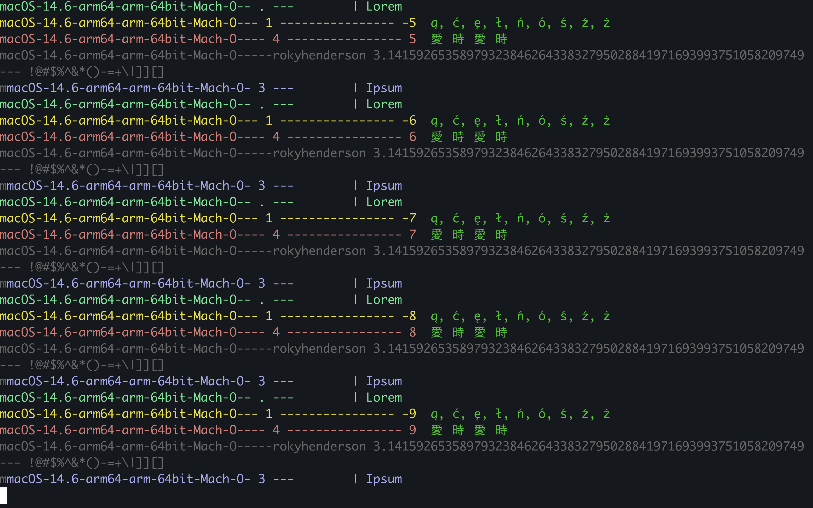

# 


## Install
First Git clone the repo with the following
```
git clone https://github.com/rhhen122/lorem.git
```
Then add to your `.bashrc` or your `.zshrc` file with the following
```
alias lorem='python3 ~/lorem/lorem.py'
```
## Usage
Type `lorem` anywhere in your terminal to run the program